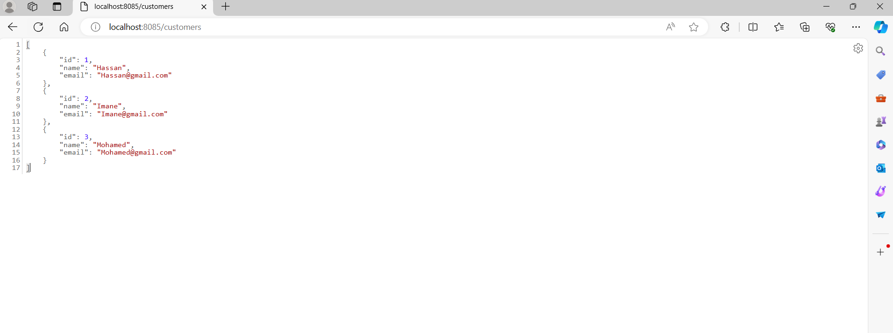
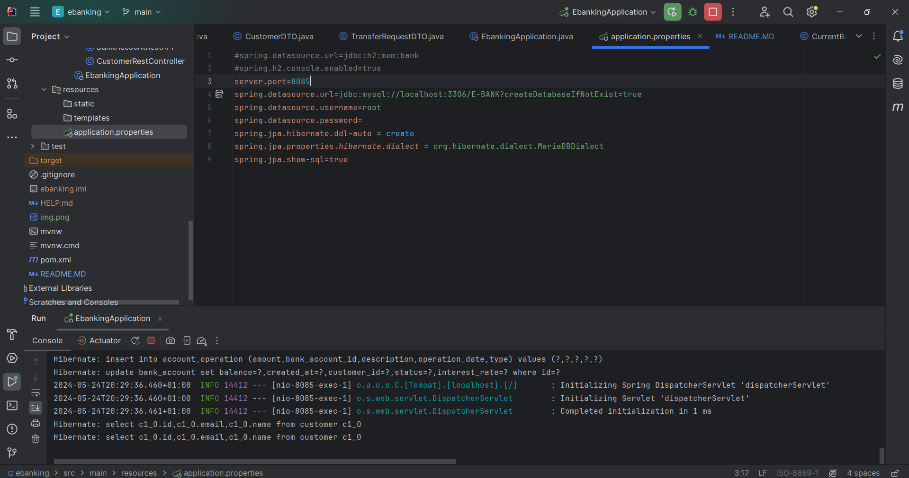
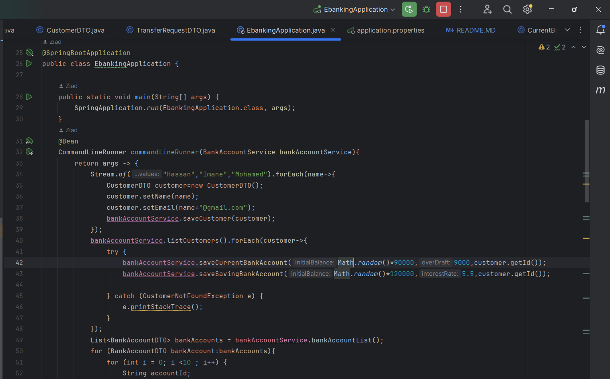

# Maven with dependency - Spring Angular JWT de Digital Banking

## Partie Backend
* ###### entités JPA : Customer, BankAccount, Saving Account, CurrentAccount, AccountOperation
* ###### Repositories
* ###### interfaces JPA Repository basées sur Spring Data
* ###### Mapper, Service, RestControllers

## Tâches Accomplies
##### Screenshot :
!

**- Tâche 1 : Exec & App.properties**

**- Tâche 2 : Exec Ebanking APP**

**- Tâche 3 : Exec PresSpringAnnot**

**- Tâche 4 : Dependency (Spring Core/Context/Beans-Junit)**

**- Tâche 5 : Config.txt**

**- Tâche 6 : Test with JunitAssert**
